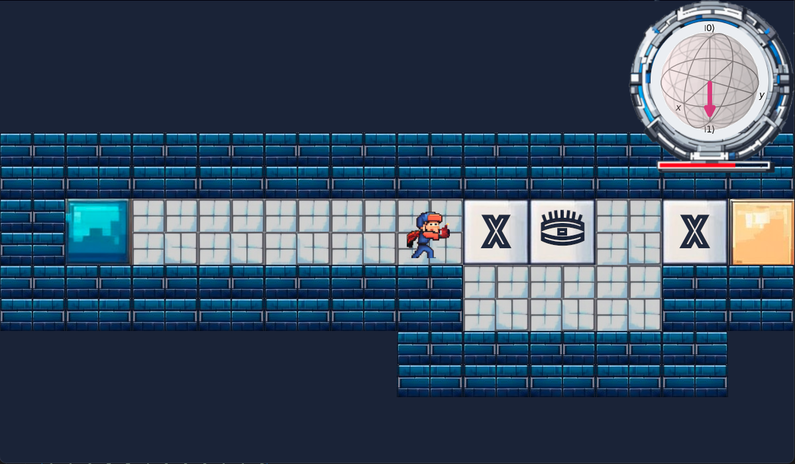

# QBomb

[](https://youtu.be/sRcrjSNwUf8)

Click image above to see video.

The game which teaches two fundamental topics in quantum computing: 1-qubit Bloch sphere and measurement process.

You are an unfortunate hero, which carries a bomb which is going to explode in couple of next seconds!
Your task is to defuse it and carry it from the starting tile to the finish tile!

Starting tile             |  Finish tile
:-------------------------:|:-------------------------:
  |  

Luckily, your future is not entirely hopeless, as the trigger of the bomb is a 1-qubit sensor which upon measurement might or might not start the explosion:

 

If after the measurement the state of the sensor is $| 0 \rangle$, the bomb explodes, is the system collapses to the state $| 1 \rangle$, you are temporarily safe.

Why temporarily? Because the system is measured repeatedly every couple seconds.

The current state of the system is displayed on a Bloch sphere, the time until next measurement is indicated with red progress bar.

Be aware that on your way you will encounter quantum gates, which change the state of the sensor.
On the one hand, you can use them to defuse the bomb before next measurement.
On the other hand, sometimes you will be forced to activate, the previously defused trigger.

In order to beat the levels of the game you will need both understanding of basics of quantum computing and dexterity combined.
 **Good luck!**

---
## Installation

```
git clone https://github.com/gczelusta/QBomb.git
cd QBomb
conda env create --file enviroment.yml
conda activate QBombEnv
python3 main.py
```

---
| CONTROLS |        |
|----------|--------|
| movement | arrows |
| confirm  | enter  |
| go back  | escape |

---
All 2D assets were generated with Stable Diffusion XL and then modified with Gimp 2.10.
