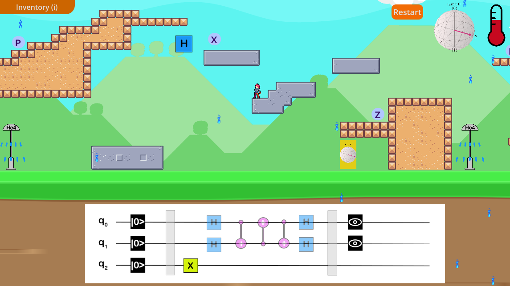

# The Entangled Explorer
This project was developed for the Quantum Games Hackathon 2023 organised by the Quantum AI Foundation. The main goal of the game is to learn how to manipulate quantum gates and circuits in a fun and interactive way.

## Backstory
In the not-so-distant future, a brilliant young quantum programmer named Max finds himself at the epicenter of a failed experiment that forever alters the course of his life. In his research laboratory, Max and his team of physicists were on the brink of unlocking new potentials in quantum computing. Unfortunately, their ambitious experiment took an unexpected turn.

During the experiment, a catastrophic mishap occurred, leaving Max’s quantum state entangled with the very particles he was studying. As a result, his body is constantly on the brink of instability. When his concentration wavers, his temperature rises rapidly, threatening to throw his quantum state into chaos.

Max embarks on a perilous journey through a surreal, quantum-inspired world. He must navigate treacherous platforms, solve intricate quantum circuits, and harness his newfound abilities to control his temperature. All the while, he's driven by the hope of one day reversing the experiment's effects and returning to his normal state.
With each level presenting a new quantum challenge, can the Entangled Explorer regain control of his quantum state, and uncover the secrets of the experiment that changed his life forever? 

## How to play
Use the arrow keys ↑, ← & → to move the character across platforms to collect logic gates. The goal is to collect all the gates necessary to complete the displayed circuit, all the while keeping the character’s temperature under control through the helium gas showers. 

You can try the game online at https://simonr99.itch.io/entangledexplorer



## How to run it locally

```bash
git clone https://github.com/QuantumETS/EntangledExplorer.git
cd build/web
conda env create -f ./environment.yml
conda activate entangled-explorer
python serve.py
```

Then you can go to localhost:8000 in your favorite browser to play the game.

## How to develop

Install godot 4.1.1 from https://godotengine.org/download, then clone the repository and open the project in godot 4.1.1

## Presentation video 

## Copyright
This program is under the MIT license. 
